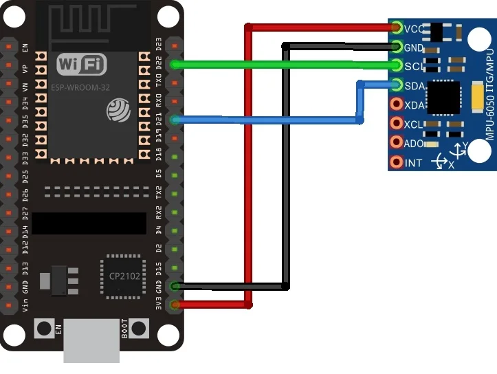

# IOT--Mini-Project-2
| **Student name**                                             | **Student ID**                 |
| :--------------------------------------------------- | :--------------------------- |
| Toseef Ahmed |  2307270 |
| Hung Trinh   |  2307229 |
| Mazen Hassaan | 2307227 |
---
This project showcases a wireless communication setup employing two Xiao BLE ESP32-C3 boards. The transmitting board is integrated with an MPU6050 accelerometer. The system is engineered to identify movements using the MPU6050.

# Hardware components used in the project: 
---
- Xiao BLE ESP32-C3
- MPU6050 Accelerometer

# Technologies used:
---
- Edge Impulse is used for training the MPU6050 data.
- ESPNOW is used for wireless communication.

# Getting Started:
---
1. First, clonse the repository
2. Hardware Setup: Connect transmitter esp32 board with MPU6050

3. Edge Impulse Setup:
- First, create an account on Edge Impulse
- Run the edge impuse following the installation tutorial on the Edge Impulse docs
- Open the CMD and runs this command

4. The operation:
   - You have to provide names for each of the three axis used as aX, aY, aZ and a name for the device
   - After that the device is connected with the Edge Impulse and the project is now initiated:
     
   - By clicking on the data acqusition on the side menu, the set for model training is captured
   - The next step would be adding at least 15 sample models for each gesture of the overall gestures
     

   - By going to the Impulse Design on the left menu, you can add spectral analysys as a processing block and Neural Network Classification as a learning block. A specific window size has to be kept and then the impulse is saved.
   - 
   - Now, it's time to head to spectral features to generate features.
   - 
   - Proceed to the NN classifier, choose the ESP Eye board, and initiate the model training. Move on to the deployment section, opt for the Arduino IDE, and initiate the build process. Generate the Arduino library through these steps. Then, Open the Arduino IDE, navigate to Sketch, choose Include Library, add the zip file, and select the downloaded library from Edge Impulse.
   - The model library can be found in the repository. Uplaod the firmware in the transmitter and then try performing up down and left right movements. They will be recognized and picked up by the transmitter board and they will be sent to be displayed in the console.
   - The Console  will display whether if the movements are either left right movements or up down and this will be identified by the state. If it's on, then a left right movement has been identified, if the state is off, then an up down movement was identified.

# Video Demonstration:
---
https://drive.google.com/drive/folders/1A7tCZA68bAW4zLrpGGLcQZjfZEfavsw8?usp=sharing

